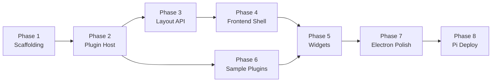

# Dashberry — Implementation Plan

> Desktop dashboard app: Electron + Angular 21 (Signals) + ASP.NET Core 9
> Dev: Ubuntu AMD64 · Deploy: Raspberry Pi 4/5 ARM64

---

## Overview

Build a plugin-based desktop dashboard that runs inside Electron, with an Angular 21 frontend communicating over localhost HTTP/WebSocket to an ASP.NET Core 9 backend. The dashboard supports draggable/resizable widget grids (GridStack), a data-only plugin system (C# DLLs + Node.js processes), and three initial widget types: Trading Price Card, Multi-Asset Line Chart, and AI Info Card.

---

## Phases

### Phase 1 — Project Scaffolding & Dev Tooling ✅ DONE

Set up the monorepo structure, tooling, and `npm run dev` workflow.

| Step | What | Details |
|---|---|---|
| 1.1 | Create root `package.json` | Scripts: `dev`, `build`, `start`. Use `concurrently` to run Angular + .NET + Electron |
| 1.2 | Scaffold Angular app | `ng new frontend --style=scss --routing --standalone` inside `dashberry/frontend/` |
| 1.3 | Scaffold .NET Web API | `dotnet new webapi -n backend` inside `dashberry/backend/` |
| 1.4 | Create Electron shell | `electron/main.js` (launches .NET, waits with `wait-on`, opens BrowserWindow) + `electron/preload.js` |
| 1.5 | Configure environments | Angular `environment.ts` → `apiUrl: 'http://localhost:5000'`. .NET `appsettings.json` → CORS for `http://localhost:4200` |
| 1.6 | Verify `npm run dev` | All three processes start, Angular serves at :4200, .NET at :5000, Electron window opens |
| 1.7 | Add `.gitignore` | Include `data/`, `node_modules/`, `dist/`, `bin/`, `obj/` |

#### Dependencies to install

**Root:** `concurrently`, `cross-env`, `wait-on`, `electron`, `electron-builder`, `electron-log`
**Frontend:** `@angular/material`, `@angular/cdk`, `ngx-echarts`, `echarts`, `@ngrx/signals`, `gridstack`
**Backend:** `Swashbuckle.AspNetCore`, `Microsoft.AspNetCore.SignalR`

---

### Phase 2 — Backend: Contracts & Plugin Host

Build the data-only plugin system on the .NET side.

| Step | What | Details |
|---|---|---|
| 2.1 | Create `Dashboard.Contracts` class library | `IWidget`, `IWidgetContext`, `WidgetManifest`, `SettingsField`, `DisplayType` enum |
| 2.2 | Implement `PluginHostService` | Scans `/plugins` at startup, loads C# DLLs in isolated `AssemblyLoadContext`, spawns Node.js processes via stdio JSON |
| 2.3 | Add `WidgetsController` | `GET /api/widgets` → lists all loaded plugins with manifests. `GET /api/widgets/{id}/data` → returns widget data. `POST /api/widgets/{id}/settings` → updates settings |
| 2.4 | Add SignalR hub | `WidgetHub` — pushes real-time data updates to Angular |
| 2.5 | Error isolation | Wrap all plugin calls in try/catch. Return structured JSON errors. C# plugins in own `AssemblyLoadContext`, Node plugins as child processes |
| 2.6 | Add `DisplayType` enum values | `PriceCard`, `MultiLineChart`, `AiInfoCard` (from widget-components spec) |

---

### Phase 3 — Backend: Layout API

JSON file-based layout persistence.

| Step | What | Details |
|---|---|---|
| 3.1 | Create `LayoutService` | CRUD for layout files. Each layout = `{name}.layout.json` in `DataPath`. Tracks active layout in `state.json` |
| 3.2 | Create `LayoutController` | `GET /api/layouts` — list all. `GET /api/layouts/{name}` — get one. `PUT /api/layouts/{name}` — save. `POST /api/layouts` — create. `DELETE /api/layouts/{name}` — delete (block "default"). `POST /api/layouts/{name}/reset` — reset to empty |
| 3.3 | Default layout | Auto-create `default.layout.json` on first run. Cannot be deleted |
| 3.4 | Configure `DataPath` | Read from `appsettings.json`. Default to `./data/layouts/` |

---

### Phase 4 — Frontend: Shell & Layout System

Angular 21 dashboard shell with GridStack.

| Step | What | Details |
|---|---|---|
| 4.1 | Angular Material setup | Install theme, configure `app.config.ts` with Material providers, set dark-mode palette |
| 4.2 | Dashboard shell component | Top bar (app name, layout tabs, edit toggle), main content area (GridStack grid) |
| 4.3 | GridStack integration | 12-column grid. Wrap in Angular directive/component. Bind to layout data model |
| 4.4 | Layout service (Angular) | HTTP calls to Layout API. Signal-based state with `@ngrx/signals` SignalStore |
| 4.5 | Layout tabs | Switch/create/rename/delete layouts. Double-click to rename |
| 4.6 | Edit mode vs view mode | Toggle button. Edit mode shows drag handles, resize handles, ✕ buttons. View mode locks grid |
| 4.7 | Widget picker panel | Slide-in panel listing available plugins (from `GET /api/widgets`). Click to add to grid |
| 4.8 | Auto-save | Debounce 800ms after grid changes → `PUT /api/layouts/{name}` |

---

### Phase 5 — Frontend: Widget Components

Three initial widget types, each rendered based on `DisplayType` from the plugin manifest.

| Step | What | Details |
|---|---|---|
| 5.1 | Widget frame component | Generic wrapper: header (title, settings gear, ✕ in edit mode), content area, error overlay. Routes to specific component based on `DisplayType` |
| 5.2 | Trading Price Card | Displays current price, 24h change %, high/low. Uses signal for reactive updates. Backend plugin calls CoinGecko / Alpha Vantage |
| 5.3 | Multi-Asset Line Chart | ngx-echarts line series. Time range selector (1H, 24H, 7D, 30D). Multiple assets on same chart. Incremental rendering for streaming |
| 5.4 | AI Info Card with Chat | Summary panel + chat input. Quick-reply buttons + free text. Calls .NET backend → Ollama / LLM API. Bounded history (last 10 messages) |
| 5.5 | Settings dialog | Auto-generated from `SettingsField[]` in manifest. Material form fields. Saves via `POST /api/widgets/{id}/settings` |
| 5.6 | ngx-echarts setup | Tree-shakeable import (only line chart components). Dark theme registration |

---

### Phase 6 — Sample Plugins

Ship working plugins so the dashboard has content on first run.

| Step | What | Details |
|---|---|---|
| 6.1 | CPU Monitor (C#) | Implements `IWidget`. Reads CPU % via `System.Diagnostics`. Returns gauge data. `DisplayType = Gauge` |
| 6.2 | Crypto Price (C#) | Calls CoinGecko free API. Returns price card + line chart data. Configurable symbol via settings |
| 6.3 | AI Summary (C#) | Calls Ollama HTTP API on localhost:11434. Returns AI info card data. Configurable topic |
| 6.4 | GPIO Temp Sensor (Node) | Reads Pi GPIO temp sensor. Stdio JSON protocol. Only runs on Pi |

---

### Phase 7 — Electron Shell Polish ✅ DONE

| Step | What | Details |
|---|---|---|
| 7.1 | Main process | Launch .NET backend as child process. Wait for ready. Open BrowserWindow pointing to Angular build |
| 7.2 | System tray | Minimize to tray. Context menu: Show, Quit |
| 7.3 | Auto-start (Pi) | Generate systemd service file or `~/.config/autostart` desktop entry |
| 7.4 | Build & package | `electron-builder` config for both `linux-x64` and `linux-arm64` |

---

### Phase 8 — Raspberry Pi Deployment 🚧 PARTIAL (8.1 done)

| Step | What | Details |
|---|---|---|
| 8.1 | Pi build script | `npm run build` → Angular production build + `dotnet publish` |
| 8.2 | Test on Pi 4/5 | Clone repo on Pi, install deps, build, run. Verify dashboard works on HDMI display |
| 8.3 | Document Pi setup | Update README with step-by-step Pi first-time setup instructions |

---

## Suggested Implementation Order

> [!IMPORTANT]
> **Phases 2 & 3** (backend) and **Phase 4** (frontend shell) can be developed in parallel once scaffolding is done. Phase 5 requires both backend plugins and frontend shell to be ready.

---

## Tech Stack Summary

| Layer | Technology | Version |
|---|---|---|
| Frontend | Angular (Signals, standalone components) | 21 |
| Charts | ngx-echarts + Apache ECharts (tree-shaken) | 21.x / 5.x |
| State | @ngrx/signals (SignalStore) | 21 |
| UI Kit | @angular/material + @angular/cdk | 21 |
| Grid | GridStack.js | 10.x |
| Backend | ASP.NET Core Web API | 9 |
| Realtime | SignalR | 9 |
| Storage | JSON files (System.Text.Json) | built-in |
| Desktop | Electron | 34 |
| Runtime | Node.js 22 LTS · .NET 9 | — |
| AI (local) | Ollama (llama3.2:3b / gemma2:2b) | latest |

---

## Verification Plan

Since this is a greenfield project with no existing tests, verification is structured per phase:

### Phase 1 — Scaffolding
- Run `npm run dev` → confirm Angular serves at `:4200`, .NET at `:5000`, Electron window opens
- Run `dotnet build` in `backend/` → no errors
- Run `ng build` in `frontend/` → no errors

### Phases 2–3 — Backend API
- Run `dotnet test` on backend unit tests (to be created alongside implementation)
- Manually test with Swagger UI at `http://localhost:5000/swagger`:
  - `GET /api/widgets` returns loaded plugins
  - `GET /api/layouts` returns layout list
  - `PUT /api/layouts/default` saves and persists to JSON file

### Phases 4–5 — Frontend
- Run `ng test` on Angular unit tests (to be created alongside implementation)
- **Browser test**: open dashboard → verify GridStack grid renders → drag a widget → verify auto-save calls API
- **Browser test**: open widget picker → add a Price Card → verify it renders with data

### Phases 6 — Plugins
- Start backend with sample plugins in `/plugins` → verify `GET /api/widgets` lists them
- Verify CPU Monitor returns data without crashing host
- Verify plugin crash (intentional bad plugin) returns structured JSON error, dashboard stays up

### Phases 7–8 — Electron & Pi
- `npm run build` completes without errors
- Electron app launches from built artifacts
- **Manual verification on Raspberry Pi** (requires physical device):
  1. Clone repo on Pi
  2. `npm install && npm run build`
  3. Launch app → dashboard renders on HDMI display

> [!NOTE]
> For phases 7–8, I'll need you to test on your Raspberry Pi. I can prepare the build scripts and systemd service file, but physical device testing requires your hardware.

---

## User Review Required

> [!IMPORTANT]
> **Phase ordering**: This plan suggests building backend-first (Phases 2–3), then frontend (4–5). Alternatively, we could build a frontend mockup first with fake data. Which do you prefer?

> [!IMPORTANT]
> **Scope for first iteration**: Should all 8 phases be built, or would you like to start with a subset (e.g., Phases 1–5 only, skipping Electron polish and Pi deployment for now)?
